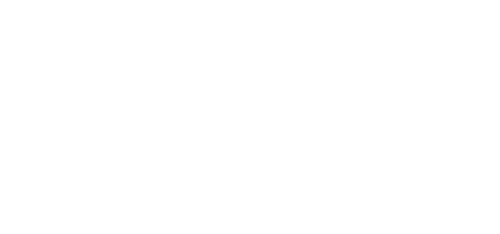

<p align="center">
  
</p>

<div align="center">

**[AJAN AI](https://github.com/takimcizgisi/ajan)** — Tamamen yerel, açık kaynak yapay zeka kodlama ajanı.


_Gemma 4 E2B + Node-llama-cpp ile tamamen çevrimdışı çalışır — verileriniz cihazınızdan çıkmaz._

<div align="center">
  <table>
    <tr>
      <td align="center" style="background-color:#e0f2f1; border:2px solid #00897b; border-radius:8px; padding:12px 18px;">
        <b style="color:#004d40; font-size:1.1em;">✨ AJAN V3 (v0.3.0)</b><br>
        <span style="color:#b71c1c;"><b>⚠️ DENEYSEL:</b></span> <span style="color:#00695c;">Yeni nesil özellikler ve iyileştirmelerle geliştirilmeye devam ediyor; sürüm değişebilir ve hata içerebilir.</span>
      </td>
    </tr>
  </table>
</div>

</div>

---

## 🛠️ Nasıl Yapıldı?

> Bu proje, **🧢 Vibecoding** yöntemiyle [ **Önemli:** Bu projenin **kaynak kodları GitHub deposunda bulunmaz.** Her **release** sürümünde kaynak kodu, ayrı bir paket (zip/tar) olarak **Release dosyalarına** yüklenir ve dağıtı[...]
>
> - ⚠️ Kaynak kodları repo'da **bulunmaz** — yalnızca release paketleri üzerinden yayımlanır.
> - 📦 Her yeni sürüm, kaynak kodu paketiyle birlikte release olarak yayımlanır.
> - 🔗 Kaynak kodu almak için en güncel sürümün **Release** sayfasındaki kaynak arşivini indirin.

### Gereksinimler

- ✅ **Node.js** 18 veya daha yeni
- ✅ **npm** veya **yarn**
- ✅ (İsteğe bağlı) GPU hızlandırma için **CUDA**

### ☁️ Global Kurulum (npm)

```bash
npm install -g @takimcizgisi/ajan
```

Global kurulumdan sonra `ajan` komutunu doğrudan terminalden kullanabilirsiniz.

### 🧑‍💻 Geliştirici Kurulumu

```bash
git clone https://github.com/takimcizgisi/ajan.git
cd ajan
npm install
npm run build:all
```

---

## 🚀 Kullanım

### 💻 CLI (Terminal) Arayüzü

```bash
npm run dev          # Geliştirme modunda CLI
npm start            # Derlenmiş CLI
ajan                 # Global kurulumda sohbet TUI'si
```

### 🖥️ GUI (Masaüstü) Arayüzü

```bash
npm run dev:gui      # Geliştirme modunda GUI (build + electron)
npm run gui          # Paketlenmiş GUI
ajan gui             # Global kurulumda GUI
```

> 💡 GUI ilk açılışta model indirilmesini isteyebilir; ilerleme arayüzde gösterilir.

### 📦 npm Betikleri

| Betik | Açıklama |
|-------|----------|
| `build` | CLI (TypeScript) derle |
| `build:gui` | GUI (TypeScript) derle |
| `build:all` | CLI + GUI birlikte derle |
| `build:electron` | Electron tip kontrolü (derleme yok) |
| `doctor` | Sistem / bağımlılık kontrolü |
| `test:tools` | Araçların smoke testleri |
| `release` | Sürüm paketleme |

### 🧩 CLI Alt Komutları

```bash
ajan                 # Sohbet TUI'sini başlat (varsayılan)
ajan gui             # Masaüstü arayüzünü başlat
ajan model list      # Modelleri listele
ajan model install <id>  # Model indir
ajan model use <id>      # Modeli etkin yap
ajan model remove <id>   # Modeli sil
```

---

## ⌨️ CLI Komutları (TUI içinde)

| Komut | Açıklama |
|-------|----------|
| `/yeni` | Yeni oturum başlat |
| `/clear` | Konuşma geçmişini temizle |
| `/sessions` | Kayıtlı oturumları listele |
| `/resume <id>` | Kayıtlı oturumu yükle |
| `/export [dosya]` | Oturumu Markdown'a dışa aktar |
| `/kopyala` | Son çıktıyı/yanıtı panoya kopyala |
| `/todo` | Görevler: `ekle <metin> \| sil <no> \| temizle \| list` |
| `/model` | Model: `list \| install <id> \| use <id> \| remove <id>` |
| `/cd <dizin>` | Çalışma dizinini değiştir |
| `/doctor` | Sistem kontrolü (GPU, model, SAC) |
| `/stats` | Bağlam ve oturum istatistikleri |
| `/tools` | Ajanın araçlarını listele |
| `/config [anahtar değer]` | Ayarları göster/değiştir |
| `/help` | Komutları listele |
| `/exit` | Çıkış yap |

> **Yapılandırma örnekleri**
>
> ```text
> /config temperature 0.7      # Sıcaklık (0-2)
> /config maxTokens 2048       # Maks. üretim token'ı (>=256)
> /config maxSteps 40          # Maks. ajan adımı (1-200)
> ```

---

## 📚 Kullanım Örnekleri

### 💬 Basit Sohbet

```bash
ajan
```

```text
> Merhaba
AJAN  Merhaba! Size nasıl yardımcı olabilirim?
```

### 🔧 Kodlama / Görev Ajanı

```bash
ajan
> Bu projenin testlerini çalıştır ve sonuçları özetle
```

AJAN, terminal aracını kullanarak komutu çalıştırır, çıktıyı analiz eder ve sonucu özetler — görev tamamlanana kadar araçları otonom şekilde sırayla kullanır.

### 🧠 Model Yönetimi

```bash
ajan model list
ajan model install gemma-4-e2b-q4-k-m
ajan model use gemma-4-e2b-q4-k-m
```

### 📦 Bağımlılıklar

| Paket | Rol |
|-------|-----|
| **node-llama-cpp** | Yerel LLM motoru (yükleme + inferans) |
| **chalk** | Terminal renklendirme (TUI) |
| **diff** | Satır farkı / yama hesaplama |
| **js-yaml** | Yapılandırma / YAML ayrıştırma |
| **adm-zip** | Model arşivlerini açma |
| **electron** · **tsx** · **typescript** | GUI kabuğu ve dev araçları |

---

## 🛠️ Araçlar (Tools)

AJAN çekirdeği, otonom görevleri yerine getirmek için şu araçlara sahiptir:

| Araç | Görev |
|------|-------|
| **file** | Dosya oku / yaz / listele |
| **edit** | Mevcut dosyaları düzenle |
| **filesys** | Dosya sistemi operasyonları |
| **patch** | Yama (diff) uygula / üret |
| **terminal** | Shell komutları çalıştır |
| **web** | Web sayfası getir / ara |
| **memory** | Kısa / uzun dönem bellek yönetimi |
| **data** | Veri işleme / sorgulama |
| **taskComplete** | Görev tamamlandı işareti |

> ⚙️ Her araç çağrısı TUI/GUI'de görsel olarak izlenir: `çalıştırılıyor... → ✅ / ❌`

---

## ⚙️ Nasıl Çalışır?

| # | Aşama | Açıklama |
|---|-------|----------|
| 1 | **Model** | Gemma 4 E2B (GGUF) `node-llama-cpp` ile yüklenir; GPU varsa CUDA, yoksa CPU kullanılır |
| 2 | **Ajan döngüsü** | `AjanService` mesajı modele iletir; model düşünür ve ilgili aracı (`tools/`) çağırır. Sonuç tekrar modele verilir; görev bitene kadar döngü sürer (maxSt[...] |
| 3 | **Bağlam** | Uzun konuşmalarda eski turlar otomatik sıkıştırılır, bağlam penceresi aşılmaz |
| 4 | **Oturumlar** | Konuşmalar kaydedilir: `/sessions` listeler, `/resume <id>` geri yükler, `/export` Markdown'a döker |
| 5 | **Güvenlik** | Lock mekanizması aynı anda tek arayüz çalıştırır; SAC durumu `/doctor` ile izlenir |

---

## ⌨️ Kısayollar

| Tuş | İşlev |
|-----|-------|
| `Enter` | Mesaj gönder |
| `ESC` | Üretimi durdur |
| `TAB` | Komut otomatik tamamlama (TUI) |
| `↑` / `↓` | Geçmiş / imleç gezinme |
| `Page Up` / `Down` | Kaydırma |
| `Ctrl + C` / `/exit` | Çıkış |
| GUI üst menü | Yeni sohbet · Projeler · İndirmeler · Ayarlar |

---

## 📂 Proje Yapısı

```text
ajan/
├── config/                 # Yapılandırma dosyaları
├── dist/                   # Derlenmiş çıktı
├── scripts/                # Betikler (release, smoke-test)
├── src/
│   ├── index.ts            # Paket girişi
│   ├── service.ts          # Servis katmanı
│   ├── cli/                # CLI & TUI arayüzü
│   │   ├── index.ts
│   │   └── tui.ts
│   ├── core/               # Ajan çekirdeği (agent)
│   ├── engine/             # Llama motoru + model yönetimi
│   ├── electron/           # GUI kabuk (main + preload)
│   ├── gui/                # Masaüstü arayüzü (HTML/CSS/JS/TS)
│   ├── tools/              # Dosya, terminal, web, patch araçları
│   └── utils/              # Yardımcı işlevler
└── package.json
```

> **GUI** — `src/gui/` altında `html/`, `css/`, `ts/` (kaynak) ve `js/` (derlenmiş) klasörlerinden oluşur; `assets/` içinde Bootstrap, font ve görseller bulunur.

---

## 🤝 Katkı & Lisans

### 🤝 Katkıda Bulunma

Katkılar her zaman memnuniyetle karşılanır!

1. Repository'yi **fork** edin
2. Yeni bir **branch** oluşturun
3. Değişikliklerinizi yapın
4. Açıklayıcı **commit** mesajları kullanın
5. **Pull request** gönderin

### ⚖️ Lisans

Bu proje **[GNU GPL v3.0](./LICENSE)** — _GNU General Public License v3_ — ile yayımlanan **özgür ve copyleft** bir yazılımdır.

GPL-3.0 kapsamında bu projeyi;

- ✅ Kullanabilirsiniz
- ✅ İnceleyebilirsiniz
- ✅ Değiştirebilirsiniz
- ✅ Dağıtabilirsiniz (ücretli/ücretsiz)

Ancak;

- ❌ Değiştirdiğiniz/dağıttığınız sürümleri aynı GPL-3.0 lisansı altında yayımlamadan dağıtamazsınız (copyleft)
- ❌ Kaynak kodunu erişilebilir kılmadan yalnızca derlenmiş halini dağıtamazsınız
- ❌ Bu yazılım için **hiçbir garanti** verilmez

> **Not:** Bu proje, özgür yazılım felsefesiyle geliştirilmiştir. GPL-3.0 yazılım özgürlüğü sağlar; telif hakkı sahipliğini devretmez. Tam lisans metni için **[LICENSE](./LICENSE[...]

---

## 💛 Destekleyin

Açık kaynak, topluluğun desteğiyle yaşar. Bu projeye katkıda bulunmanın birkaç yolu vardır:

### ⭐ AJAN'a Destek

- Repoya ⭐ **yıldız** verin — görünürlük her şeydir
- 🐛 Bug bildirin veya 💡 özellik önerisi açın (Issues)
- 🔧 Kod, dökümantasyon veya çeviri katkısı sağlayın
- 📣 Projeyi çevrenizle paylaşın

### 🌐 OpenCode'a Destek

**AJAN AI**, 🧢 Vibecoding yöntemiyle [opencode](https://opencode.ai) kullanılarak geliştirilmiştir. OpenCode — açık kaynak ajanının gelişimine de destek olabilirsiniz:

- ⭐ [GitHub'da opencode](https://github.com/anomalyco/opencode) repolarına yıldız verin
- 💻 Yapay zeka ajanı geliştiricisiyseniz PR'larınızla katkı sağlayın
- 🗣️ Topluluğa katılın (Discord) ve geri bildirim verin

> Open source, birlikte geliştirilen yazılımın gücüdür. 💪

---

<div align="center">

**👨‍💻 İbrahim Anadol** · TakımÇizgisi Yazılım Geliştirme Grubu

© 2026 İbrahim Anadol · Tüm hakları saklıdır.

_Bu projeyi 🤖⭐ bir yıldızla destekleyebilirsiniz!_

</div>

<p align="center">
  
</p>
