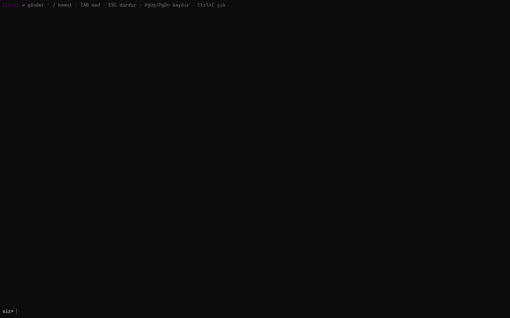
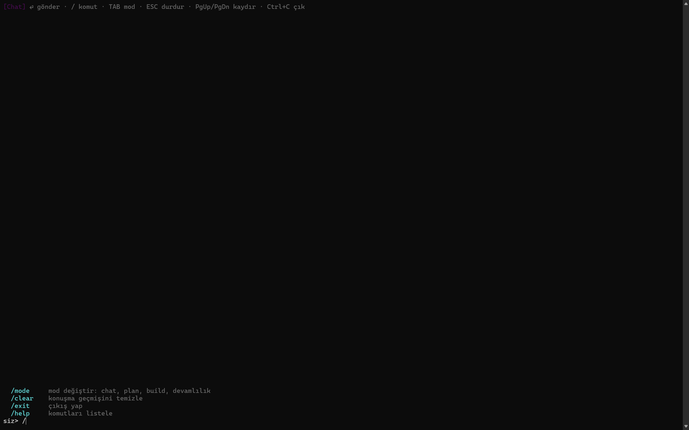
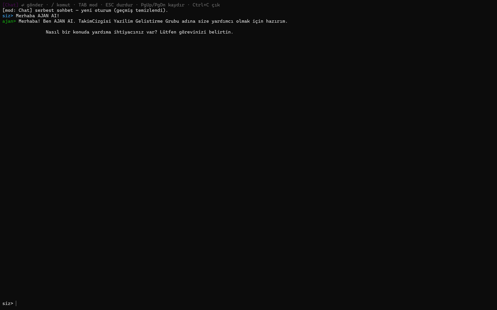

# AJAN – Otonom AI Kodlama Ajanı


AJAN, yerel makinenizde çalışan, Gemma tabanlı bir yapay zeka kodlama ajanıdır. CLI arayüzü ile yazılım geliştirmeyi, kod analizi yapmayı ve karmaşık görevleri otomatikleştirmeyi sağlar.

> 📊 **Derleme Durumu ve Yönetim:** Detaylı bilgi için [AJAN_INFO.md](./Source/AJAN_INFO.md) sayfasını ziyaret edin.

## Özellikler

- 🤖 **Yerel AI Motoru** – Node-llama-cpp ile tamamen yerel çalışır
- 💻 **CLI Arayüzü** – Kullanıcı dostu terminal uygulaması
- 🔄 **Çoklu Modlar** – Chat, Plan, Build ve Devamlılık modları
- ⚡ **Hızlı Yanıtlar** – Ağ gecikmesi olmadan anında işlem
- 🛠️ **Araç İntegrasyonu** – Dosya, terminal, web ve patch araçları

## Teknik Bilgiler

- **Model:** Gemma 4 (GGUF formatı)
- **RAM/VRAM Kullanımı:** ~4 GB
- **Performans:** Biraz gecikmeli fakat hızlı yanıt verir
- **Kurulum:** Direkt AJAN kurulumu yeterlidir, ek konfigürasyon gerektirmez
- **Bağlam Penceresi:** 128K token (ana model)

## Kurulum

### Gereksinimler
- Node.js 18.0.0 veya daha yeni sürüm
- npm veya yarn

### Adımlar

```bash
# Repository'i klonla
git clone https://github.com/takimcizgisi/ajan.git
cd AJAN/Source

# Bağımlılıkları yükle
npm install

# Projeyi derle
npm run build

# CLI'yi çalıştır
npm start
```

## Kullanım

### Geliştirme Modu

```bash
# Chat modunda başla
npm run dev:chat

# Doctor modunu çalıştır
npm run doctor

# Doğrudan başlat
npm run dev
```

### Komutlar

- `/mode` – Mod değiştir (chat, plan, build, devamlılık)
- `/clear` – Konuşma geçmişini temizle
- `/help` – Komutları listele
- `/exit` – Programdan çık

### Kısayollar

- `TAB` – Mod döngüsü
- `Ctrl+C` – Çık
- `Page Up/Down` – Kaydır
- `↑/↓` – Geçmiş arasında gezin

## Yapı

```
Source/
├── src/
│   ├── index.ts              # Ana giriş noktası
│   ├── cli/                  # CLI uygulaması
│   │   ├── index.ts
│   │   └── tui.ts            # Terminal UI
│   ├── config/               # Konfigürasyon
│   ├── core/                 # Temel ajanı mantığı
│   ├── engine/               # AI motoru
│   └── tools/                # Araçlar ve entegrasyonlar
├── config/                   # Model konfigürasyonları
└── package.json
```

## 📸 Ekran Görüntüleri

### Terminal Arayüzü


### Komut Menüsü


### Chat Sohbeti


## Katkı

Katkılar memnuniyetle karşılanır! Lütfen değişikliklerinizi açıklayıcı commit mesajları ile gönderin.

## Lisans

GNU GPL v3 – Detaylar için [LICENSE](./LISANCE) dosyasına bakın.

---

**Geliştirici:** İbrahim Anadol ve TakımÇizgisi Yazılım Geliştirme Grubu  
**Son Güncelleme:** 2026